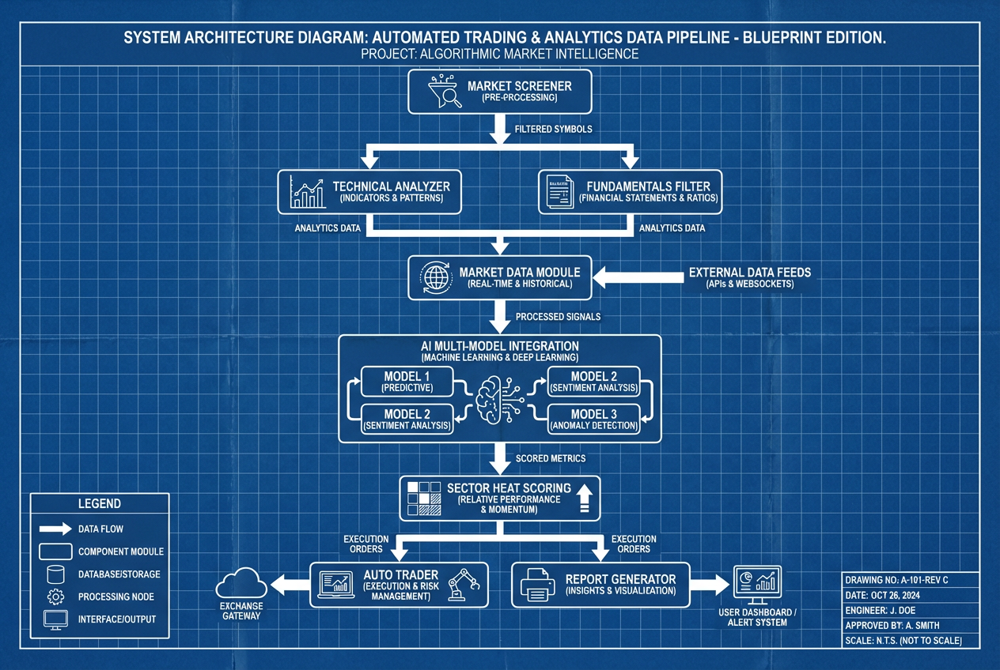
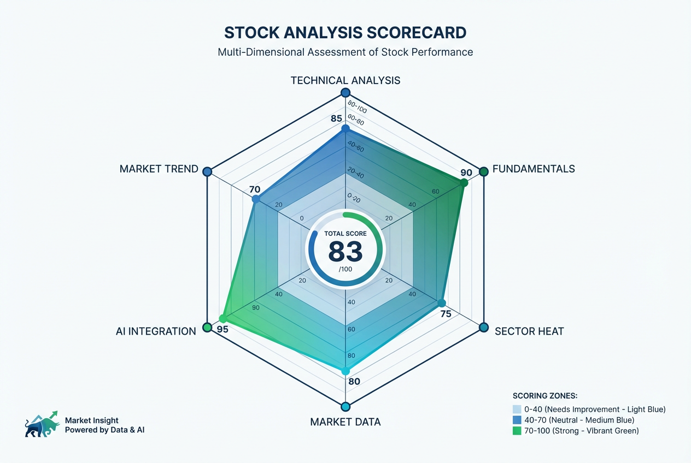
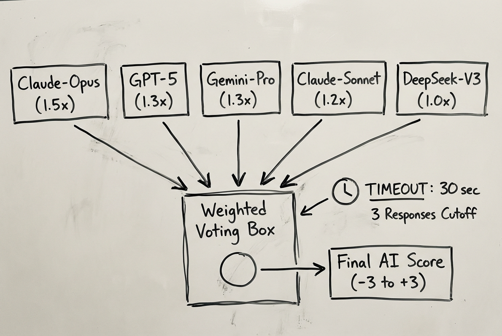
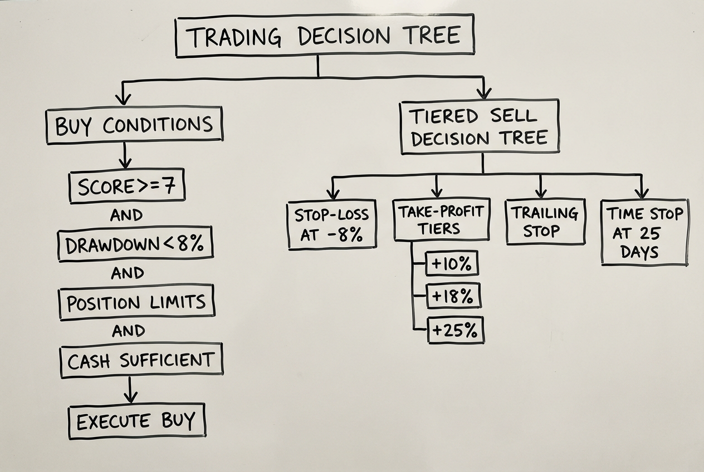
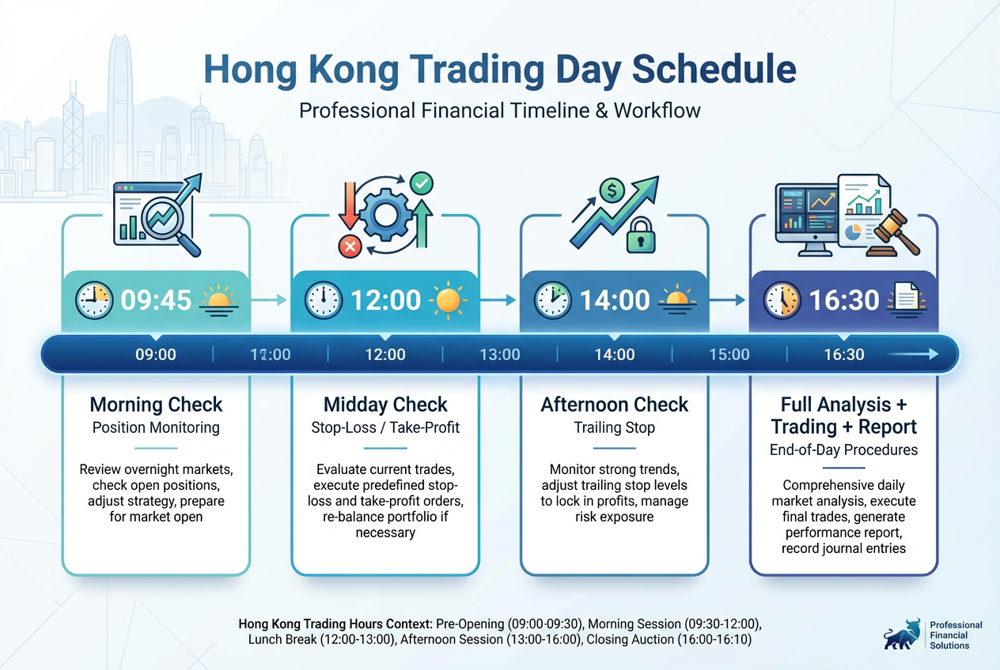

# 港股量化分析 & 模拟交易系统


基于多因子评分的港股量化分析系统。每日自动扫描全市场，经技术面、基本面、市场数据、板块热度、大盘趋势、AI 多模型集成六重筛选后执行模拟交易。行情数据来自真实市场接口，交易执行为本地模拟，不连接任何券商。


## 环境要求

- Python >= 3.11
- [uv](https://docs.astral.sh/uv/) 包管理器

## 快速开始

```bash
# 安装 uv（如未安装）
curl -LsSf https://astral.sh/uv/install.sh | sh

# 安装依赖（自动创建虚拟环境）
uv sync

# 配置环境变量
cp .env.example .env   # 编辑 .env 填入必要配置（见下方环境变量说明）

# 运行
uv run hkstock-daily               # 手动执行一次完整分析+交易
uv run hkstock-cron                # 启动定时调度（后台常驻）
uv run hkstock-dashboard            # 启动 Web 看板（:8888）
```

> `.env` 已在 `.gitignore` 中，不会被提交。

## 环境变量

配置文件模板：`.env.example`，复制为 `.env` 后按需填写。

| 变量 | 必填 | 默认值 | 说明 |
|------|------|--------|------|
| `CODEBUDDY_API_KEY` | AI 分析必需 | - | CodeBuddy API Key，未配置时自动跳过 AI 分析 |
| `WECOM_TARGET` | 可选 | - | 企业微信推送目标 ID，不填则不推送 |
| `SERVER_IP` | 可选 | `127.0.0.1` | 报告中看板链接的服务器 IP |
| `DASHBOARD_USER` | 可选 | - | 看板登录用户名（不填则不启用认证） |
| `DASHBOARD_PASS` | 可选 | - | 看板登录密码 |
| `DASHBOARD_HOST` | 可选 | `127.0.0.1` | 看板绑定地址（`0.0.0.0` 允许外部访问） |
| `DASHBOARD_PORT` | 可选 | `8888` | 看板端口 |

## 系统架构



全市场扫描与 IPO 新股合并标的池后，依次经过技术分析、市场数据、基本面过滤、板块热度、AI 集成分析，最终由交易引擎执行分批建仓/止盈/回撤保护，并生成每日报告。

## 策略详解

### 选股

每次分析从零开始，不使用预设股票列表：

1. 扫描港股主板全量代码（00001-04999、06xxx、09xxx），约 6000 个代码位
2. 初筛：成交额 >= 5000 万 HKD，股价 >= 1.0 HKD
3. 精筛：拉 60 天历史，过滤低波动（< 0.8%）和游资爆炒（近 5 日成交额 > 长期 10 倍）
4. 按活跃度评分（成交额 70% + 波动率 30%）取 Top 100
5. 上市满 15 天的 IPO 新股自动注入
6. 自由流通比例 < 15% 的股票在基本面阶段排除

### 评分



最终评分由以下维度叠加，>= 7 分触发买入：

```
最终评分 = 技术面 + 动量 + 基本面 + 公告情绪 + 新闻情绪 + 板块热度 + 大盘调整 + 市场数据 + AI集成
```

**技术面（-10 ~ +10）**

| 指标 | 看多 | 看空 |
|------|------|------|
| RSI(14) Wilder EMA | < 35 超卖 +3 | > 70 -2，> 80 -4 |
| 均线 MA10/MA30 | 金叉 +2 | 死叉 -2 |
| MACD | 金叉+零轴上 +2，金叉 +1 | 死叉 -2 |
| 布林带 | 触下轨 +2 | 触上轨 -2 |
| ADX > 25 强趋势 | 顺势 +1 | 逆势 -1 |
| 成交量 > 1.5x | 放量上涨 +2 | 放量下跌 -2 |
| 量价背离 | 缩量下跌（抛压减弱）+1 | 价涨量缩（动能不足）-1 |
| 动量(20日) | > 10% +2，> 5% +1 | < -10% -1 |

**基本面（-5 ~ +5）**

| 指标 | +2 | +1 | -1 | -2 | 一票否决 |
|------|----|----|----|----|----------|
| PE（行业相对） | < 行业 0.5x | < 行业 0.8x | > 行业 1.5x | > 行业 2.0x | > 200 排除 |
| ROE | > 25% | > 15% | < 5% | | |
| PB | < 1 | 1-1.5 | | | < 0 排除 |
| 股息率 | > 5% | > 3% | | | |
| PEG | < 0.5 | < 1.0 | | > 3.0 | |
| FCF Yield | > 8% | > 5% | < 0 | | |

另有港交所公告情绪（-3 ~ +3）和新闻舆情（-2 ~ +2）叠加。大盘偏空时所有正评分 -2。市场数据信号综合打分后映射为仓位倍数（0.3x ~ 1.2x）。15 大板块（200+ 关键词匹配），热门板块 +1 ~ +3，冷门板块 -1 ~ -2。

**AI 多模型集成（-3 ~ +3）**



5 个模型并行调用，3 个返回后额外等 30 秒截止。加权平均分 1-10 映射为 -3 ~ +3 调整分。模型一致性 < 50% 时调整分减半。

### 交易规则



**买入**（以下条件全部满足）：

1. 综合评分 >= 7
2. 组合回撤未超过停买线（8%）
3. 单只仓位 <= `MAX_POSITION`，且不超过 ATR 风控仓位
4. 仓位受市场信号倍数调节（0.3x ~ 1.2x）
5. 现金扣除 `RESERVE_CASH` 后充足
6. 与现有持仓 30 天日收益率相关性 < 0.85
7. 同板块已持仓 < 2 只
8. 分批建仓：首批 50%，后续 30% + 20%

**卖出**（分级触发）：

| 条件 | 动作 |
|------|------|
| 亏损 >= 8% | 止损清仓 |
| 盈利 >= 10% / 18% / 25% | 分批止盈：1/3 → 1/3 → 清仓 |
| 盈利 > 10%，跌破最高价 x 95% | 跟踪止损 |
| 盈利 > 5%，跌破成本 x 102% | 保本止损 |
| 持仓 >= 25 天，涨幅 < 2% | 时间止损 |
| 组合回撤 >= 12% | 强制减仓 50%（全部持仓） |
| 评分 <= -5 或出现死叉 | 信号转弱清仓 |

卖出时自动处理碎股：如剩余不足一手则全部卖出。

### 费用

真实港股单边费率：

| 费目 | 费率 |
|------|------|
| 券商佣金 | 0.03%（min 3 HKD） |
| 平台费 | 15 HKD/笔 |
| SFC 征费 | 0.00278% |
| HKEX 交易费 | 0.00565% |
| CCASS 结算费 | 0.002%（min 2 HKD） |
| 印花税 | 0.1%（ceil to 1 HKD）[2024 年起] |

HKD/CNY 汇率从 open.er-api.com 实时获取，4 小时缓存。

## 调度



每个交易日自动运行，跳过周末和港股假期（`src/hkstock/core/config.py` 中 `HK_HOLIDAYS`，需每年手动更新）。

## 回测

```bash
uv run python -m hkstock.strategy.backtest              # 完整回测（默认）
uv run python -m hkstock.strategy.backtest weekly       # 最近一周
uv run python -m hkstock.strategy.backtest multiwindow  # 多区间（防过拟合）
```

回测引擎与交易策略对齐（含动量/量价背离信号），输出 Sharpe Ratio、Calmar Ratio、最大回撤、年化收益/波动率等风险指标，包含滑点模拟（单边 0.05%）。

> 回测结果存在生存者偏差，实际表现可能不如回测。

## 配置参数

`src/hkstock/core/config.py` 中可调整的核心参数（交易规则中已列出的阈值不再重复）：

| 参数 | 默认值 | 说明 |
|------|--------|------|
| `TOTAL_CAPITAL` | 100,000 | 总资金（CNY） |
| `MAX_POSITION` | 15,000 | 单只最大仓位（CNY） |
| `MAX_POSITIONS` | 10 | 最多同时持仓股票数 |
| `RESERVE_CASH` | 15,000 | 保留现金（CNY） |
| `ATR_RISK_PER_TRADE` | 2% | ATR 单笔风险比例 |
| `RSI_OVERSOLD` | 35 | RSI 超卖阈值 |
| `RSI_OVERBOUGHT` | 70 | RSI 超买阈值 |
| `MA_SHORT` / `MA_LONG` | 10 / 30 | 短期/长期均线周期 |
| `MOMENTUM_PERIOD` | 20 | 动量计算周期（交易日） |
| `MIN_FREE_FLOAT_PCT` | 15% | 最低自由流通比例 |

## 部署

使用 Supervisor 管理后台服务，支持崩溃自动恢复：

```bash
# 安装 supervisor（系统级，不通过 uv）
pip install supervisor

# supervisor 配置文件位于 /etc/supervisor/conf.d/hkstock.conf
# 两个进程均通过 uv run 启动，自动使用项目虚拟环境
```

| 进程 | 命令 | 说明 |
|------|------|------|
| `hkstock-dashboard` | `uv run hkstock-dashboard` | Web 看板，端口 8888 |
| `hkstock-cron` | `uv run hkstock-cron` | 定时调度守护进程 |

```bash
./manage.sh status       # 查看状态
./manage.sh start        # 启动
./manage.sh stop         # 停止
./manage.sh restart      # 重启
./manage.sh log-dash     # 看板日志
./manage.sh log-cron     # 调度日志
```

## 项目结构

```
hk-stock/
  pyproject.toml                项目配置 + 依赖声明（uv 管理）
  uv.lock                       依赖锁文件
  manage.sh                     Supervisor 管理脚本
  templates/index.html          看板前端
  src/hkstock/                  主包
    __init__.py                 版本号
    core/
      config.py                 全局配置 + .env 加载 + 港股假期日历
      types.py                  共享类型定义（TypedDict）
      io.py                     统一 JSON 文件 I/O（原子写入）
      logging.py                统一日志配置
    data/
      database.py               SQLite 持久化
      market_data.py            市场级数据：南向资金/AH溢价/VHSI/卖空/MSCI
      real_data.py              腾讯 API 接口（行情/K线/手数）
    analysis/
      indicators.py             指标计算：RSI / MACD / BB / ADX / ATR / 动量
      scoring.py                统一评分引擎（ScoreBreakdown / 钳位 / 映射）
      fundamentals.py           基本面过滤(PE/PEG/FCF) + 港交所公告 + 新闻舆情
      sector.py                 板块分类(15板块 200+关键词) + 热度/冷门检测
      ai_analyzer.py            5 模型集成分析，异步并行 + 快速路径
    strategy/
      analyzer.py               技术分析主引擎 + 大盘趋势 + 市场数据集成
      screener.py               全市场扫描，成交额+波动率筛选 Top 100
      ipo_tracker.py            IPO 新股检测，上市满 15 天注入分析
      backtest.py               回测引擎（Sharpe/Calmar/滑点/偏差警告）
    trading/
      auto_trader.py            交易引擎：分批建仓/回撤保护/碎股处理/净值快照
      position_manager.py       仓位管理：持仓/三级止损止盈/分批止盈/费用/汇率
    app/
      daily_report.py           每日报告生成
      cron.py                   定时调度守护进程
      dashboard.py              Flask Web 看板（需认证）
  tests/                        测试
  data/                         运行时数据（git 忽略）
```

## 测试

```bash
uv sync --dev                                              # 安装开发依赖
uv run pytest tests/ -v                                    # 运行全部测试
uv run pytest tests/ --cov=hkstock --cov-report=term-missing  # 带覆盖率
```

## 持续集成

GitHub Actions CI 在每次 push/PR 时自动运行，测试矩阵覆盖 Python 3.11 / 3.12 / 3.13。配置见 `.github/workflows/ci.yml`。

## 数据源与免责

| 数据 | 来源 | 说明 |
|------|------|------|
| 实时行情 / K 线 / 手数 | 腾讯股票接口 (`sqt.gtimg.cn`) | 非官方公开接口，无需 API Key |
| 南向资金 / AH溢价 / VHSI / 卖空 | 东方财富 (`push2.eastmoney.com`) | 非官方接口，网络异常时自动降级 |
| HKD/CNY 汇率 | `open.er-api.com` | 免费汇率接口，4 小时缓存 |

以上均为**非官方接口**，无 SLA 保证，可能随时变更或中断。

- 本系统使用**真实市场数据**进行分析，但交易执行为**本地模拟**，不连接任何券商，不产生实际交易
- 投资有风险，系统评分仅供参考，不构成投资建议

## 许可证

本项目基于 [GPL-3.0](LICENSE) 许可证开源。
